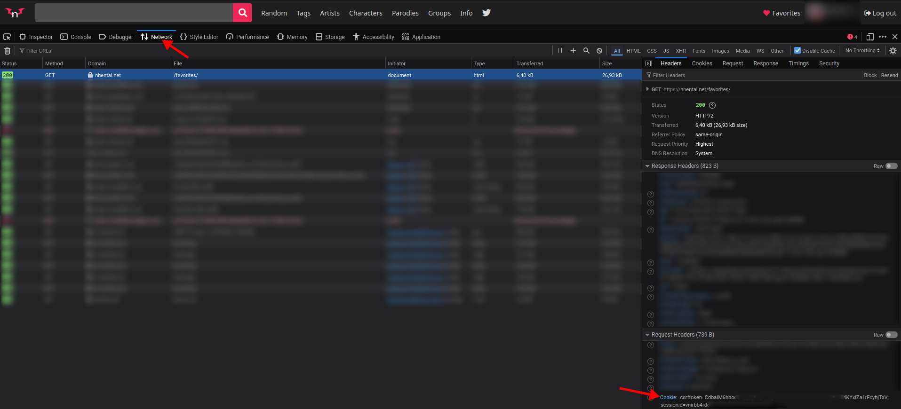

# nh-backup

**I ONLY TEST STUFF ON LINUX, NO SUPPORT FOR OTHER OPERATING SYSTEMS** 

## Setup

1. Create a `venv` with `python -m venv venv`
2. activate it `source venv/bin/activate`
3. install requirements `pip install -r requirements.txt`

## Usage

1. go to nhentai
2. login
3. open the web console and go to the network tab
4. click on your "favourites"
5. look in the network tab for something like this and copy the cookie value:

6. in the `main.py` edit the `COOKIE = "paste value here"` variable and paste the cookie value
7. run `python main.py` and wait for it to download everything
8. when done use your favorite client to download everything  
8.1. use a VPN!
